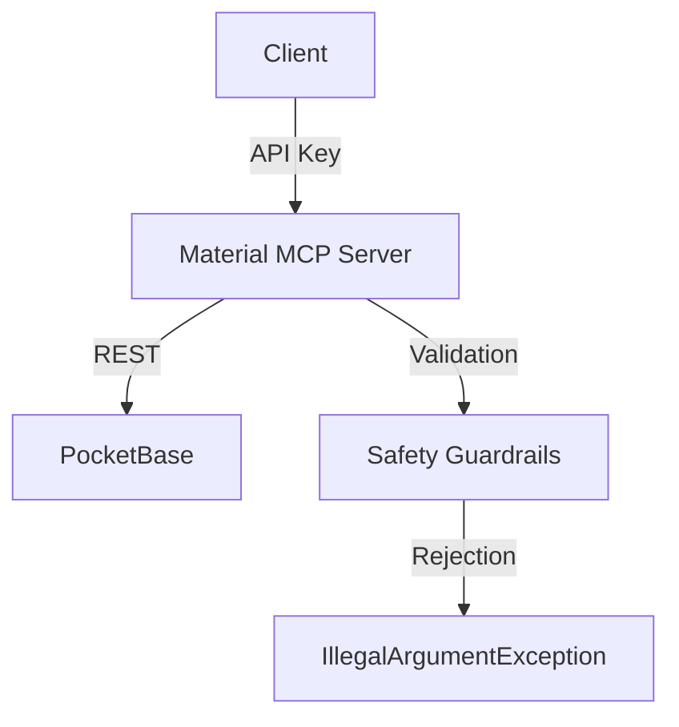

# Material MCP Server

**Microservice for Material Creation and Management**

This Spring Boot service provides MCP (Model-Controlled Prompt) tools for creating and managing resume materials (projects, achievements, skills, jobs, degrees, hobbies) with strict safety guardrails to prevent job-tailored content.

## 🔹 Features

### **🔸 Material Types**
- **Projects**: Professional and personal projects
- **Achievements**: Awards, certifications, and recognitions
- **Skills**: Technical and soft skills with proficiency levels
- **Jobs**: Work experience and employment history
- **Degrees**: Educational qualifications (coming soon)
- **Hobbies**: Personal interests and activities (coming soon)

### **🔸 MCP Tools**
| Tool Name          | Description                                                                                     | Safety Requirements                                                                                     |
|--------------------|-------------------------------------------------------------------------------------------------|---------------------------------------------------------------------------------------------------------|
| `createProject`    | Creates a new project for a user                                                                | Requires `userConfirmed=true`, rejects job-listing tailored content                                    |
| `updateProject`    | Updates an existing project after ownership validation                                          | Requires `userConfirmed=true`, ownership validation, rejects job-listing tailored content              |
| `createAchievement`| Creates a new achievement for a user                                                            | Requires `userConfirmed=true`, rejects job-listing tailored content                                    |
| `updateAchievement`| Updates an existing achievement after ownership validation                                      | Requires `userConfirmed=true`, ownership validation, rejects job-listing tailored content              |
| `createSkill`      | Creates a new skill for a user                                                                  | Requires `userConfirmed=true`, rejects job-listing tailored content                                    |
| `updateSkill`      | Updates an existing skill after ownership validation                                            | Requires `userConfirmed=true`, ownership validation, rejects job-listing tailored content              |
| `createJob`        | Creates a new job for a user                                                                    | Requires `userConfirmed=true`, rejects job-listing tailored content                                    |
| `updateJob`        | Updates an existing job after ownership validation                                              | Requires `userConfirmed=true`, ownership validation, rejects job-listing tailored content              |

## 🔹 Safety Guardrails

### **🔸 User Confirmation Requirement**
- All creation/update operations require `userConfirmed=true`
- Missing confirmation throws `IllegalArgumentException`

### **🔸 Job-Listing Reference Detection**
- **Detected Patterns**: `job listing`, `job description`, `tailor`, `specific opportunity`, `job posting`, `job requirement`, `job ad`, `hiring for`
- **Action**: Throws `IllegalArgumentException` with guidance to create authentic materials

### **🔸 Ownership Validation**
- Update operations validate record ownership before modification
- Prevents unauthorized updates to other users' materials

## 🔹 Configuration

### **🔸 Application Properties**
```properties
# Server
server.port=8081

# PocketBase Connection
pocketbase.base-url=http://localhost:8090
pocketbase.admin-email=admin@example.com
pocketbase.admin-password=admin

# Frontend
frontend.base-url=https://cv-generator.example.com

# MCP Server Name
spring.ai.mcp.server.name=material-mcp
```

### **🔸 Safety Instructions (Embedded in Prompts)**
1. **Authenticity**: Never create materials tailored to job listings
2. **User Consent**: Always require `userConfirmed=true`
3. **Ownership**: Validate record ownership before updates
4. **Content Safety**: Reject job-listing references in all fields
5. **Separation of Concerns**: This server only creates materials, not CV profiles
6. **Architectural Isolation**: Operates as a separate service from CV generation

## 🔹 Usage

### **🔸 Tool Invocation Example**
```java
// Create a new project
MaterialResponse.ProjectResponse response = materialMcpTools.createProject(
    new MaterialRequest.CreateProjectRequest(
        "user123",
        true, // userConfirmed
        new MaterialRequest.ProjectData(
            "CV Generator",
            "Web application for generating resumes",
            "2023-01-01",
            "2023-12-31",
            "Developer",
            "Java, Spring, React",
            "Backend development",
            "Completed MVP"
        )
    )
);
```

### **🔸 Error Handling**
```java
try {
    materialMcpTools.createJob(jobRequest);
} catch (IllegalArgumentException e) {
    // Handle missing confirmation or job-listing references
    System.err.println("Error: " + e.getMessage());
}
```

## 🔹 Testing

Run the test suite:
```bash
./mvnw test
```

### **🔸 Test Coverage**
- **Success Paths**: All tools with valid input
- **Safety Validation**: Missing user confirmation, job-listing references
- **Ownership Validation**: Update operations with ownership checks

## 🔹 Development

### **🔸 Prerequisites**
- Java 17+
- Maven 3.8+
- PocketBase (for local testing)

### **🔸 Build & Run**
```bash
# Build
./mvnw clean package

# Run
./mvnw spring-boot:run
```

## 🔹 Security

### **🔸 Authentication**
- **API Key**: Required for all `/mcp` endpoints
- **Bearer Token**: Supports OAuth2 tokens
- **Stateless**: No session management

### **🔸 Authorization**
- **Path-Based**: `/mcp/**` requires authentication
- **Ownership**: Update operations validate record ownership

## 🔹 Architecture



### **🔸 Key Components**
- **`MaterialMcpTools`**: MCP tool implementations with safety validation
- **`MaterialPocketBaseClient`**: PocketBase REST client
- **`AiTokenAuthenticationFilter`**: API key/Bearer token authentication
- **`SecurityConfig`**: Stateless security configuration

## 🔹 License

Copyright © 2024 Resumate. All rights reserved.