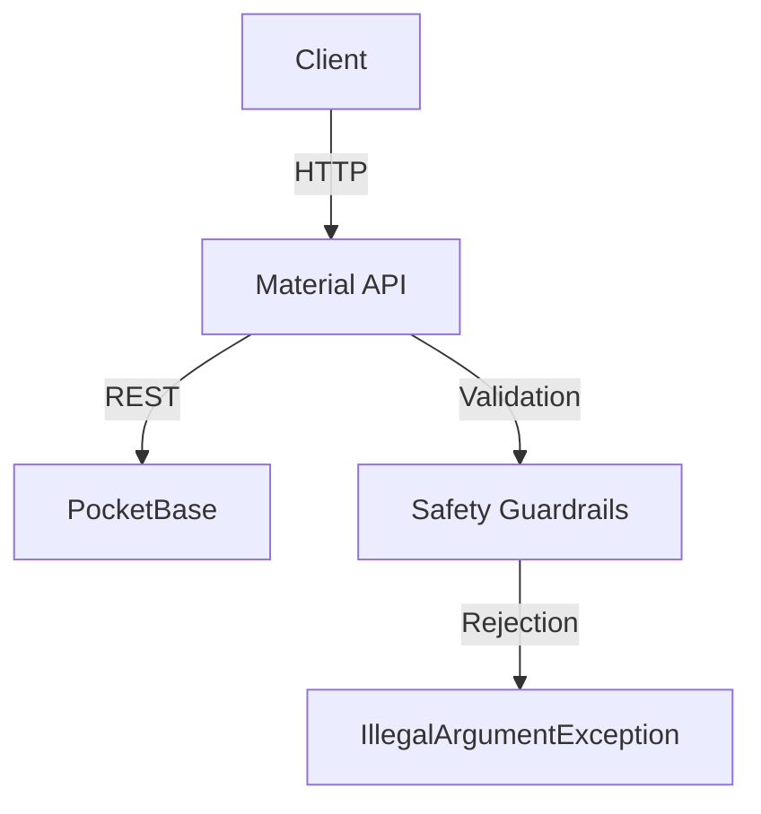

# Material MCP

Spring AI MCP server for creating and updating the authenticated user's resume materials. The Streamable HTTP endpoint is `/mcp/materials`.

## Tools

| Tool |
|---|---|
| `createProject` / `updateProject` |
| `createAchievement` / `updateAchievement` |
| `createSkill` / `updateSkill` |
| `createJob` / `updateJob` |
| `createDegree` / `updateDegree` |
| `createHobby` / `updateHobby` |

### Request data

Every tool request contains `data` and `userConfirmed`. The server derives the persisted owner from the authenticated API token; callers cannot supply an owner. `userConfirmed` must be `true`.

| Material | Required `data` fields | Optional `data` fields |
|---|---|---|
| Project | `name` | `description`, `url`, `date`, `picture`, `type`, `file`, `achievements`, `sortOrder` |
| Achievement | `title` | `description`, `sortOrder` |
| Skill | `name` | `category`, `type`, `level`, `sortOrder` |
| Job | `label`, `company`, `position`, `startDate`, `type` | `endDate`, `responsibilities`, `location`, `sortOrder`, `skills`, `projects`, `achievements` |
| Degree | `title` | `school`, `year`, `level`, `sortOrder` |
| Hobby | `name` | `description`, `sortOrder` |

## 🔹 Safety Guardrails

### **🔸 User Confirmation Requirement**
- All creation/update operations require `userConfirmed=true`
- Missing confirmation throws `IllegalArgumentException`

### **🔸 Job-Listing Reference Detection**
- **Detected Patterns**: `job listing`, `job description`, `tailor`, `specific opportunity`, `job posting`, `job requirement`, `job ad`, `hiring for`
- **Action**: Throws `IllegalArgumentException` with guidance to create authentic materials

### **🔸 Authentication and ownership validation**
- The `/mcp/materials` route accepts `API_KEY: <key>` or `Authorization: Bearer resm_<key>`.
- OAuth bearer tokens are currently rejected; OAuth validation is not implemented.
- Create operations always use the authenticated token's user. Update operations authenticate to PocketBase, load the target record, and require its `user` relation to match that user. Project file/achievement links and job skill/project/achievement links are also verified as user-owned before writes.

## 🔹 Configuration

### **🔸 Application Properties**
```properties
# Server
server.port=8081

# PocketBase Connection
pocketbase.base-url=http://localhost:8090
pocketbase.service-user-email=service@example.com
pocketbase.service-user-password=service-password

# Frontend
frontend.base-url=https://cv-generator.example.com

```

## 🔹 Usage

Configure an MCP client with the `/mcp/materials` URL and the `API_KEY` header.

## 🔹 Testing

From the module directory, run:
```bash
mvn test -f pom.xml
```

From the repository root, run:
```bash
mvn test -f backend/material-mcp/pom.xml
```

## 🔹 Development

### **🔸 Prerequisites**
- Java 17+
- Maven 3.8+
- PocketBase (for local testing)

### **🔸 Build & Run**
```bash
# Build from the module directory
mvn clean package

# Run
mvn spring-boot:run
```

## 🔹 Architecture



### **🔸 Key Components**
- **`MaterialMcpTools`**: REST controller with safety validation
- **`MaterialPocketBaseClient`**: PocketBase REST client

## 🔹 License

Copyright © 2024 Resumate. All rights reserved.
